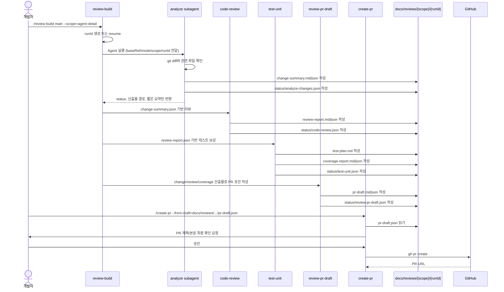
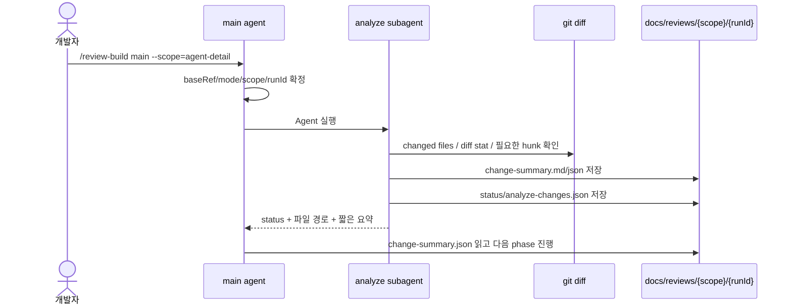
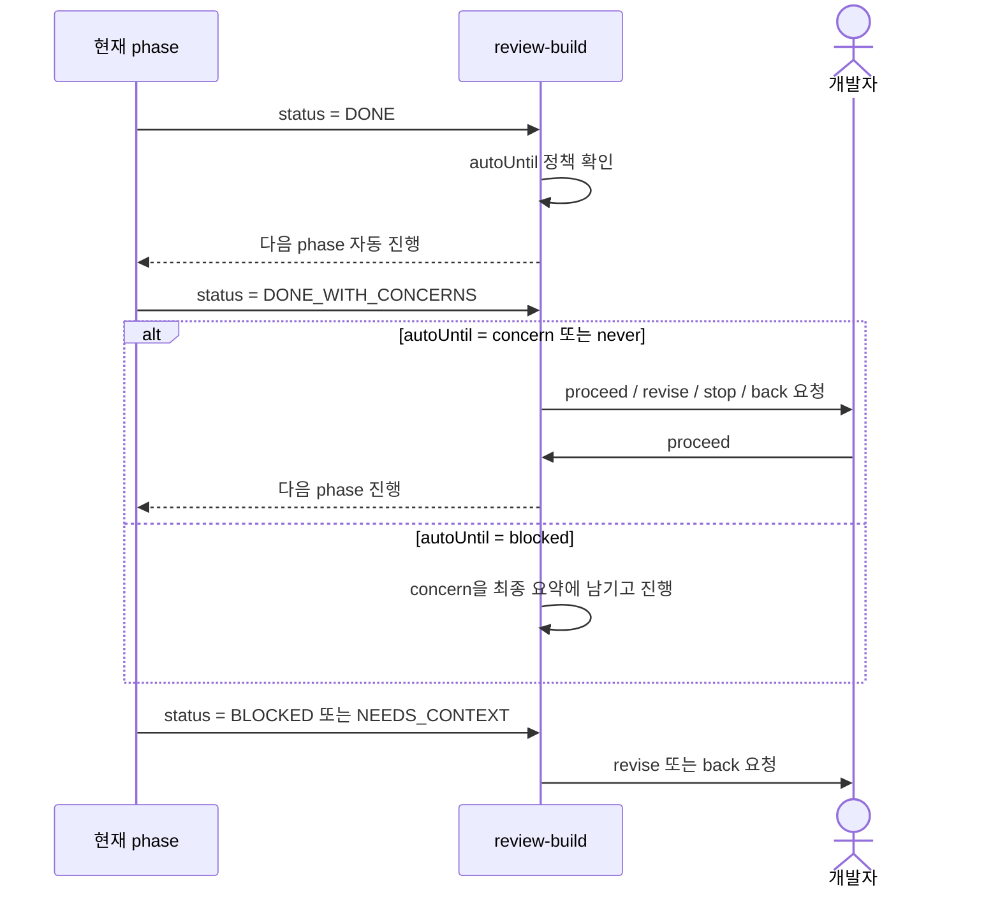
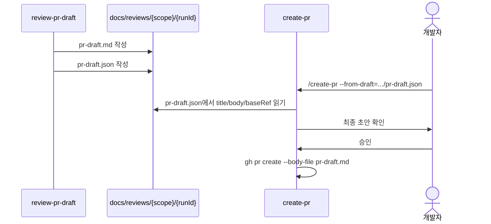

# Review Build Workflow

`review-build`는 코드 변경을 PR 준비물로 바꾸는 diff-driven quality loop의 기본 진입점이다.
메인 에이전트는 흐름을 조율하고, diff를 직접 읽는 `analyze-changes`는 서브에이전트로 격리한다.
각 단계의 결과는 `docs/reviews/{scope}/{runId}/` 아래 계약 파일로 남긴다.

## 해결하는 문제

코드 변경을 PR로 올리기 전에는 보통 아래 작업이 필요하다.

1. 어떤 파일이 왜 바뀌었는지 정리한다
2. 버그, 회귀, 테스트 공백을 리뷰한다
3. 필요한 테스트를 보강하고 검증 결과를 남긴다
4. 리뷰어가 읽기 쉬운 PR 본문을 만든다

이 작업을 한 번에 대화로만 처리하면 중간 결과가 사라지기 쉽다.
`review-build`는 각 단계의 결과를 JSON/Markdown 파일로 남겨서 다음 단계가 같은 사실을 다시 추측하지 않게 한다.
특히 diff 본문은 컨텍스트를 크게 차지하므로, Phase 1에서 서브에이전트가 읽고 요약 파일로 압축한다.

---

## 한 줄 사용법

```bash
/review-build main --scope=agent-detail
```

기본 정책은 `--auto-until=concern`이다.

- `DONE` 단계는 자동으로 다음 단계로 진행한다
- `DONE_WITH_CONCERNS`, `BLOCKED`, `NEEDS_CONTEXT`에서는 사용자 확인을 기다린다
- 모든 단계마다 직접 확인하고 싶으면 `--auto-until=never`를 사용한다

---

## 전체 흐름



핵심은 메인 에이전트가 full diff를 들고 다음 phase까지 가지 않는다는 점이다.
`analyze-changes` 서브에이전트가 diff를 읽고 `change-summary.json`으로 압축하면,
후속 phase는 그 계약 파일부터 읽는다.

---

## 단계별 역할

| Phase | Skill | 하는 일 | 다음 단계가 읽는 파일 |
| --- | --- | --- | --- |
| 1 | `analyze-changes` subagent | diff를 변경 요약과 테스트 대상으로 정리 | `change-summary.json` |
| 2 | `code-review` | findings-first 코드리뷰와 테스트 공백 정리 | `review-report.json` |
| 3 | `test-unit` | 관련 테스트 보강, coverage evidence 기록 | `coverage-report.json` |
| 4 | `review-pr-draft` | PR 템플릿에 맞춘 제목/본문 작성 | `pr-draft.json` |
| 5 | `create-pr` | 사용자 승인 후 GitHub PR 생성 | `pr-draft.json`, `pr-draft.md` |

---

## 산출물 구조

```text
docs/reviews/{scope}/{runId}/
├── change-summary.md
├── change-summary.json
├── review-report.md
├── review-report.json
├── test-plan.md
├── coverage-report.md
├── coverage-report.json
├── pr-draft.md
├── pr-draft.json
└── status/
    ├── analyze-changes.json
    ├── code-review.json
    ├── test-unit.json
    ├── review-pr-draft.json
    └── review-build.json
```

각 `status/*.json`은 stale 여부를 판단하는 기준이다.
base commit, head commit, mode, schemaVersion이 달라지면 뒤 단계는 이전 산출물을 그대로 믿지 않고 재실행한다.
phase 산출물은 status 작성 전에 `.claude/scripts/validate-contract.ts`로 필수 필드, enum, ID 연결을 검증한다.

---

## 컨텍스트 격리



메인 에이전트는 large diff를 읽지 않는다.
작은 diff인지 큰 diff인지 판단하려고 diff를 먼저 훑지도 않는다.
크기와 관계없이 `analyze-changes`는 서브에이전트가 수행한다.

서브에이전트의 최종 보고는 아래 수준으로 제한한다.

- status
- 생성한 파일 경로
- high-risk 항목 수
- testTargets 수
- unknowns 요약

full diff, 큰 hunk, 파일 전문은 메인 대화로 반환하지 않는다.

---

## Gate와 자동 진행



상태 의미는 아래처럼 읽으면 된다.

| Status | 의미 |
| --- | --- |
| `DONE` | 다음 단계로 넘어가도 된다 |
| `DONE_WITH_CONCERNS` | 진행은 가능하지만 PR 본문이나 리뷰 포인트에 남길 주의점이 있다 |
| `BLOCKED` | 현재 정보나 환경으로는 계속하면 안 된다 |
| `NEEDS_CONTEXT` | 사용자 판단이나 추가 정보가 필요하다 |

---

## PR 생성 Handoff

`review-pr-draft`는 실제 PR을 만들지 않는다.
대신 `pr-draft.md/json`을 만든다.

PR을 올릴 때는 `create-pr`에 draft 파일을 넘긴다.

```bash
/create-pr --from-draft=docs/reviews/{scope}/{runId}/pr-draft.json
```

`create-pr --from-draft`는 `title`, `body`, `baseRef`를 그대로 사용한다.
즉, review와 coverage 결과를 담은 PR 본문을 git diff 기준으로 다시 작성하지 않는다.



---

## 신입 개발자용 운영 절차

### 1. 작업 브랜치에서 변경을 끝낸다

커밋 기반 PR을 준비한다면 변경을 커밋한 뒤 시작한다.
아직 커밋하지 않은 변경까지 보고 싶으면 `--mode=working-tree`를 사용한다.

```bash
/review-build main --scope=agent-detail
```

### 2. gate가 뜨면 status를 먼저 본다

`DONE`이면 보통 그대로 진행해도 된다.
`DONE_WITH_CONCERNS`이면 concerns가 PR 본문에 설명될 내용인지 확인한다.
`BLOCKED`나 `NEEDS_CONTEXT`이면 `revise:<지시>` 또는 `back:<N>`으로 되돌린다.

예시:

```text
proceed
revise: 테스트 대상에 src/entities/agent/api도 포함해줘
back:1
stop
```

### 3. PR draft가 만들어지면 내용을 확인한다

아래 파일을 보면 된다.

```text
docs/reviews/{scope}/{runId}/pr-draft.md
```

### 4. PR을 생성한다

```bash
/create-pr --from-draft=docs/reviews/{scope}/{runId}/pr-draft.json
```

`create-pr`가 최종 제목과 본문을 보여준다.
확인 후 "올려줘"라고 승인하면 `gh pr create`를 실행한다.

---

## 언제 phase skill만 따로 쓰는가

항상 `review-build`를 쓰는 것이 기본이다.
다만 아래 경우에는 phase skill을 따로 실행할 수 있다.

| 상황 | 사용할 skill |
| --- | --- |
| diff 요약만 다시 만들고 싶다 | `analyze-changes` |
| 리뷰 findings만 다시 보고 싶다 | `code-review` |
| 테스트 보강만 다시 하고 싶다 | `test-unit` |
| PR 본문만 다시 만들고 싶다 | `review-pr-draft` |

단독 실행해도 산출물 위치와 JSON 계약은 동일하게 유지한다.

---

## 주의 사항

- `create-pr --from-draft`는 PR 본문을 재작성하지 않는다
- production code를 테스트 단계에서 수정하면 `analyze-changes`와 `code-review`를 다시 실행해야 한다
- line-level diff coverage를 증명할 수 없으면 `test-unit`은 `DONE_WITH_CONCERNS`로 남긴다
- stale status가 감지되면 뒤 단계 산출물을 그대로 믿지 않는다
- 불확실한 내용은 단정하지 않고 `unknowns` 또는 `concerns`에 남긴다

---

## 관련 파일

```text
.claude/skills/review-build/SKILL.md
.claude/skills/analyze-changes/SKILL.md
.claude/skills/code-review/SKILL.md
.claude/skills/test-unit/SKILL.md
.claude/skills/review-pr-draft/SKILL.md
.claude/skills/create-pr/SKILL.md
```
