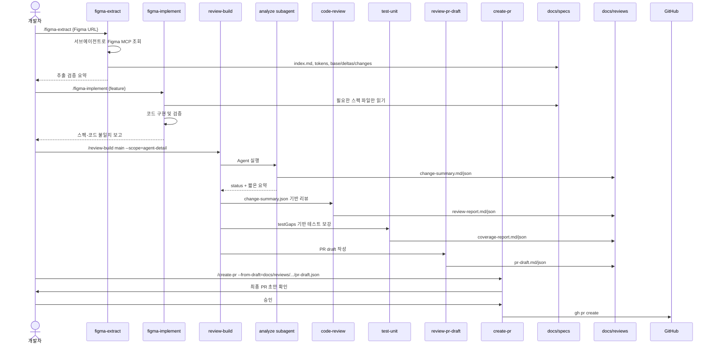
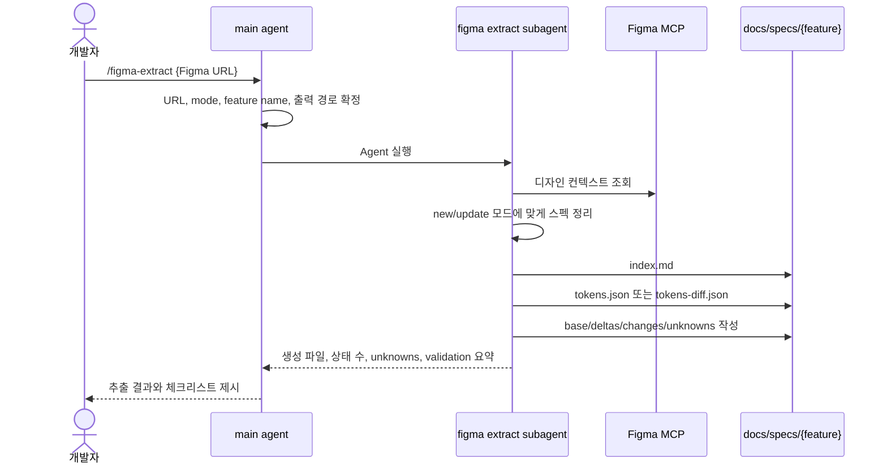
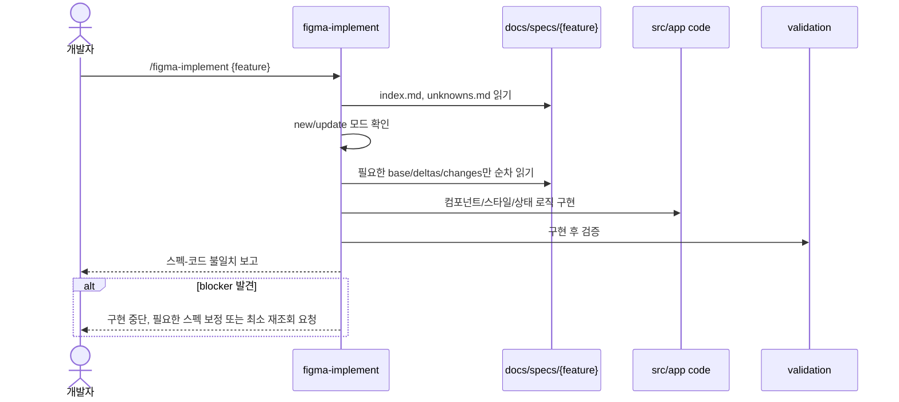
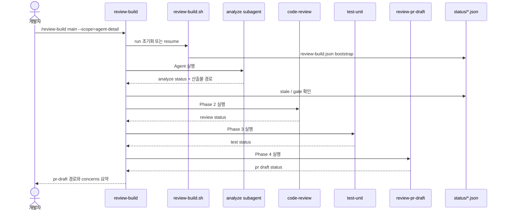
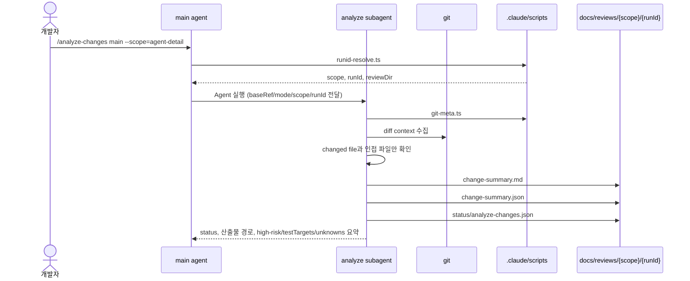
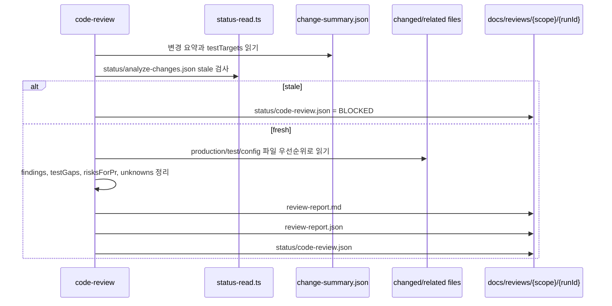
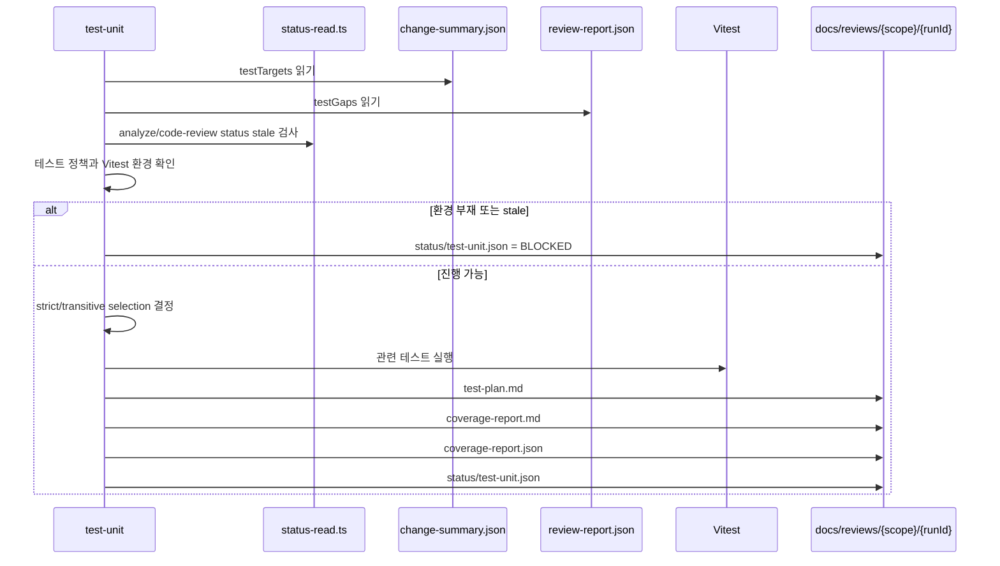
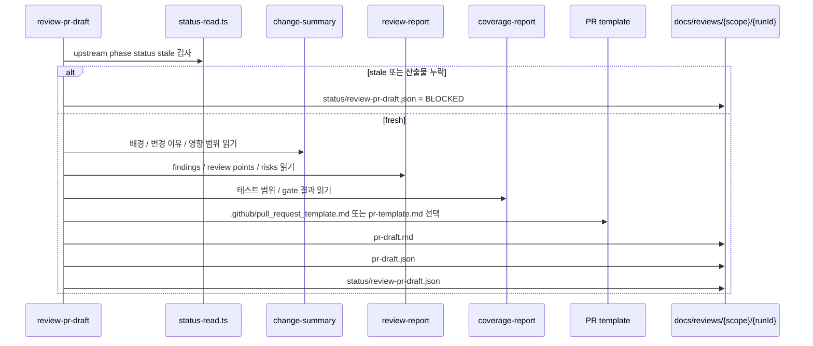
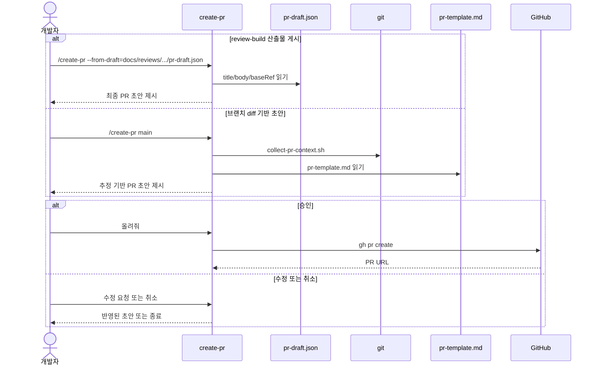

# Skills Overview

이 문서는 `.claude/skills` 전체를 한눈에 이해하기 위한 운영 지도다.
각 skill이 언제 쓰이고, 어떤 입력을 읽고, 어떤 산출물을 남기며, 다음 skill과 어떻게 이어지는지 설명한다.

상세 구현 규칙은 각 skill의 `SKILL.md`와 `references/`를 따른다.

---

## Skill Map

| Skill | 주 역할 | 주요 입력 | 주요 출력 |
| --- | --- | --- | --- |
| `figma-extract` | Figma MCP 응답을 스펙 파일로 격리 추출 | Figma URL, mode, feature name | `docs/specs/{feature}/` |
| `figma-implement` | 추출된 Figma 스펙을 코드로 구현 | `docs/specs/{feature}/` | 코드 변경, 구현 검증 보고 |
| `review-build` | diff-driven quality loop 오케스트레이션 | base branch, scope, mode | `docs/reviews/{scope}/{runId}/` 전체 산출물 |
| `analyze-changes` | diff를 change-summary 계약으로 압축 | git diff | `change-summary.md/json`, `status/analyze-changes.json` |
| `code-review` | findings-first 코드리뷰 | `change-summary.json` | `review-report.md/json`, `status/code-review.json` |
| `test-unit` | Vitest 테스트 보강과 coverage evidence 기록 | `change-summary.json`, `review-report.json` | `test-plan.md`, `coverage-report.md/json`, `status/test-unit.json` |
| `review-pr-draft` | review 산출물 기반 PR draft 작성 | change/review/coverage 산출물 | `pr-draft.md/json`, `status/review-pr-draft.json` |
| `create-pr` | PR 초안 확인 후 GitHub PR 생성 | branch diff 또는 `pr-draft.json` | GitHub PR |

---

## Trigger Keywords

각 skill의 `description`은 자동 라우팅이 자연스러운 사용자 표현을 잡도록 keyword-forward 방식으로 작성한다.
내부 phase 이름보다 사용자가 실제로 말할 법한 요청을 앞에 둔다.

| Skill | 자연어 트리거 예시 |
| --- | --- |
| `figma-extract` | Figma 디자인 추출, Figma URL 분석, 디자인 스펙화, UI 구현 전 스펙 생성 |
| `figma-implement` | Figma 디자인 구현, 추출된 디자인 스펙 구현, 화면 코드 작성 |
| `review-build` | 구현 후 PR 준비, 변경사항 분석부터 리뷰/테스트/PR draft까지 진행 |
| `analyze-changes` | 변경사항 분석, diff 요약, PR 전 변경 범위 정리, 테스트 대상 추출 |
| `code-review` | 코드 리뷰, PR 전 검토, 버그/회귀/테스트 공백 점검 |
| `test-unit` | 테스트 보강, Vitest 실행, coverage 확인, 테스트 공백 해소 |
| `review-pr-draft` | PR 초안 작성, PR 본문 정리, 리뷰어용 설명 생성 |
| `create-pr` | PR 생성, pull request 올리기, GitHub PR 게시 |

---

## 전체 흐름



---

## Figma 계열

### 1. `figma-extract`

`figma-extract`는 Figma MCP의 큰 응답을 서브에이전트에 격리한다.
메인 에이전트에는 추출 요약만 남기고, 실제 구현 정보는 `docs/specs/{feature}/`에 저장한다.



추출 검증에 실패하면 구현 단계로 넘기지 않는다.

### 2. `figma-implement`

`figma-implement`는 이미 추출된 스펙 파일만 읽어 구현한다.
기본적으로 Figma MCP를 다시 호출하지 않는다.



스펙과 다르게 구현해야 하면 이유를 사용자에게 보고한다.

---

## Review Build 계열

### 3. `review-build`

`review-build`는 코드 변경 PR 준비의 기본 진입점이다.
Phase 1의 diff 분석은 서브에이전트로 격리하고, 이후 phase는 파일 계약으로 이어간다.



사용자가 모든 단계마다 확인하고 싶으면 `--auto-until=never`를 사용한다.
기본값은 `--auto-until=concern`이다.

`--auto-until`은 phase 결과 status를 보고 다음 phase로 자동 진행할지 결정한다.

| 현재 status | `concern` | `blocked` | `before-pr` | `never` |
| --- | --- | --- | --- | --- |
| `DONE` | 자동 진행 | 자동 진행 | Phase 4 전까지 자동 진행 | gate |
| `DONE_WITH_CONCERNS` | gate | 자동 진행 | Phase 4 전까지 자동 진행 | gate |
| `BLOCKED` | gate | gate | gate | gate |
| `NEEDS_CONTEXT` | gate | gate | gate | gate |

`before-pr`은 PR draft 작성 직전에 사용자가 마지막으로 확인하도록 멈춘다.
어떤 정책이든 `BLOCKED`와 `NEEDS_CONTEXT`는 자동 진행하지 않는다.

### 4. `analyze-changes`

`analyze-changes`는 diff를 직접 읽는 phase다.
컨텍스트 절약을 위해 실제 diff 확인은 항상 서브에이전트가 수행한다.



메인 에이전트는 full diff, 큰 hunk, 파일 전문을 받지 않는다.
후속 phase는 `change-summary.json`부터 읽는다.

### 5. `code-review`

`code-review`는 변경 설명보다 findings를 먼저 정리한다.
입력은 `change-summary.json`이고, 출력은 `review-report.md/json`이다.



`testGaps[].id`는 `change-summary.testTargets[].id`와 연결되어야 한다.
`test-unit`은 이 연결을 보고 테스트 우선순위를 잡는다.

### 6. `test-unit`

`test-unit`은 Vitest 전용 phase다.
테스트를 보강하고, 어떤 수준의 coverage evidence를 확보했는지 구조화한다.



`coverageEvidence`는 `line-diff`, `file-summary`, `not-available` 중 하나다.
line-level diff coverage를 증명할 수 없으면 통과 테스트가 있어도 `DONE_WITH_CONCERNS`로 남긴다.

### 7. `review-pr-draft`

`review-pr-draft`는 실제 PR을 생성하지 않는다.
앞 phase 산출물을 PR 템플릿에 매핑해 `pr-draft.md/json`을 만든다.



게시가 필요하면 `create-pr --from-draft=docs/reviews/{scope}/{runId}/pr-draft.json`으로 넘긴다.

### 8. `create-pr`

`create-pr`는 PR 게시 담당 skill이다.
직접 브랜치 diff를 분석해 초안을 만들 수도 있고, `review-pr-draft` 산출물을 그대로 게시 입력으로 사용할 수도 있다.



`--from-draft` 모드에서는 PR 본문을 git diff 기준으로 다시 작성하지 않는다.

---

## 산출물 위치

```text
docs/reviews/{scope}/{runId}/
├── change-summary.md/json
├── review-report.md/json
├── test-plan.md
├── coverage-report.md/json
├── pr-draft.md/json
└── status/*.json

docs/specs/{feature}/
├── index.md
├── unknowns.md
├── tokens.json 또는 tokens-diff.json
├── base.md / deltas/ / independent state files
└── changes/
```

`status/*.json`은 `schemaVersion: "1.0"`을 포함한다.
phase 산출물은 다음 단계로 넘어가기 전에 `.claude/scripts/validate-contract.ts`로 필수 필드, enum 값, ID 연결을 검증한다.

| Phase | 검증 명령 | 주요 검증 |
| --- | --- | --- |
| `analyze-changes` | `validate-contract.ts --phase=analyze-changes --review-dir=...` | `change-summary.json` 필수 필드, `testTargets[].id` 중복 |
| `code-review` | `validate-contract.ts --phase=code-review --review-dir=...` | `review-report.json` 필수 필드, `testGaps[].id`와 `testTargets[].id` 연결 |
| `test-unit` | `validate-contract.ts --phase=test-unit --review-dir=...` | `coverageEvidence`, `testStatus` enum |
| `review-pr-draft` | `validate-contract.ts --phase=review-pr-draft --review-dir=...` | `title`, `body`, `baseRef`, `templateSource` 존재 |

검증 실패는 다음 phase로 넘기지 않고 해당 phase를 `BLOCKED`로 남긴다.

---

## 어떤 skill을 먼저 써야 하나

| 상황 | 시작 skill |
| --- | --- |
| Figma 디자인을 먼저 스펙화하고 싶다 | `figma-extract` |
| 추출된 Figma 스펙을 코드로 구현하고 싶다 | `figma-implement` |
| 코드 변경을 PR 준비물까지 정리하고 싶다 | `review-build` |
| diff 요약만 만들고 싶다 | `analyze-changes` |
| 기존 change-summary로 리뷰만 다시 하고 싶다 | `code-review` |
| 테스트 보강만 다시 하고 싶다 | `test-unit` |
| PR 본문만 다시 만들고 싶다 | `review-pr-draft` |
| 이미 만든 PR draft로 PR을 올리고 싶다 | `create-pr --from-draft=...` |

기본 원칙은 단순하다.
디자인 기반 작업은 `figma-extract`에서 시작해 `figma-implement`로 구현한 뒤, 생긴 코드 변경을 `review-build`로 검증하고 PR 준비까지 이어간다.
이미 코드 변경이 끝난 상태라면 `review-build`에서 바로 시작한다.
